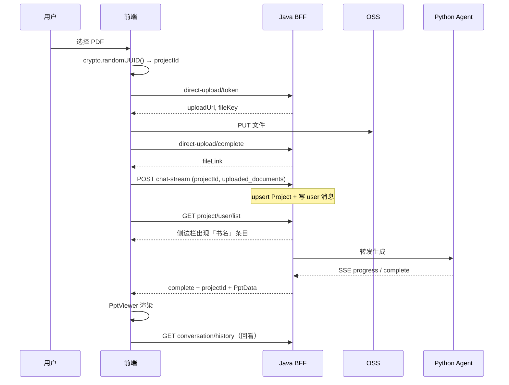

# Page2.top 前端集成说明

> 浏览器直连 Java BFF；所有路径加前缀 **`/api2`**。  
> 鉴权 Header：**`Authorization: <JWT>`**（**不要**加 `Bearer` 前缀）。  
> 统一响应：`{ code, message, data }`，`code === 0` 为成功。

---

## 0. 环境与 CORS

| 项 | 值 |
|----|-----|
| 生产 Base | `https://{host}:8446/api2/...`（按部署域名） |
| 前端来源 | `https://page2.top`、`https://www.page2.top`（调试 `http://localhost:3000`） |
| CORS 允许头 | `Authorization`、`Content-Type`、`X-Project-Id`、`X-Session-Id` |
| CORS 方法 | `GET` / `POST` / `PUT` / `DELETE` / `OPTIONS` |

OSS 直传 PUT 需在阿里云控制台为 bucket **`page2top`** 配置 CORS，来源含 `https://page2.top` 与 `https://www.page2.top`。

预检 `OPTIONS` 须返回 200/204（见 [`BACKEND_REQUIREMENTS.md`](BACKEND_REQUIREMENTS.md) §0.1）。

---

## 1. 认证

| 步骤 | 接口 | 说明 |
|------|------|------|
| 注册 | `POST /api2/user/userSignUp` | `{ email, password, nickName? }`，**不返回 JWT** |
| 登录 | `POST /api2/password/login` | `{ username, password }`，`data` = JWT 字符串 |
| Google | `POST /api2/google/login` | `{ googleEmail }`，按邮箱登录/自动注册 |
| 当前用户 | `GET /api2/user/current/detail` | **必须读 `data.id`** 作为 `userId` |

```javascript
const token = localStorage.getItem("pagereader_token");

async function apiGet(path) {
  const res = await fetch(`/api2${path}`, {
    headers: { Authorization: token },
  });
  if (res.status === 401) {
    localStorage.removeItem("pagereader_token");
    throw new Error("请重新登录");
  }
  const json = await res.json();
  if (json.code !== 0) throw new Error(json.message);
  return json.data;
}
```

| HTTP / code | 处理 |
|-------------|------|
| HTTP **401** | 清 token，跳登录 |
| `code === 900111` | 未登录 |
| `code === 900103` | refresh 过期，重新登录 |

---

## 2. 核心流程：上传 → 分析生成 → 侧边栏历史



### 2.1 前端必须做的事

1. **每次生成前**在浏览器生成 `projectId`（`crypto.randomUUID()`），写入 chat-stream body。
2. chat-stream **发出后立刻**（不必等 complete）调用 `loadProjects()` 刷新侧边栏。
3. 收到 `complete` 后再 `loadProjects()` 一次（更新 title/thumbnail）。
4. `userId` 用 `/user/current/detail` 的 **`id` 转字符串**，与 JWT 用户一致。

> **本仓库实现**：`WorkspaceGenerator` 在 SSE 连接建立时 emit `project-started`；`WorkspaceView` 调用 `loadProjects()` 并高亮侧边栏项；complete 后再次刷新。

---

## 3. 我的历史（侧边栏）

```http
GET /api2/project/user/list?page=0&size=20
Authorization: <JWT>
```

- `page`：**0-based**（Spring Page）
- `size`：每页条数，默认 20

**响应 `data`（Spring Page）：**

```json
{
  "content": [
    {
      "id": "550e8400-e29b-41d4-a716-446655440000",
      "name": "深度学习",
      "title": "深度学习",
      "thumbnailUrl": "https://...",
      "description": null,
      "updateTime": "2026-06-05T10:00:00.000+00:00",
      "createTime": "2026-06-05T09:58:00.000+00:00",
      "isPrivate": 1,
      "viewCount": 0
    }
  ],
  "totalElements": 1,
  "totalPages": 1,
  "number": 0,
  "size": 20,
  "first": true,
  "last": true
}
```

| 字段 | 说明 |
|------|------|
| `content[].id` | 与 chat-stream 请求的 `projectId` 相同 |
| `content[].name` | 优先为上传文档去后缀书名（如 `深度学习.pdf` → `深度学习`） |
| `content[].thumbnailUrl` | complete 后可能有首屏图 |

点击历史项 → `GET /api2/project/{id}` + `GET /api2/project/{id}/conversation/history` 恢复会话。

---

## 4. OSS 直传（上传 PDF）

| 步骤 | 方法 | 路径 |
|------|------|------|
| 1 拿凭证 | POST | `/api2/file/user/direct-upload/token` |
| 2 上传 | PUT | `<uploadUrl>`（按 `uploadHeaders`） |
| 3 确认 | POST | `/api2/file/user/direct-upload/complete` |

**complete 响应 `data.fileLink`** → 填入 `uploaded_documents[].url`

---

## 5. PPT 生成 — chat-stream

```http
POST /api2/agent/chat-stream
Content-Type: application/json
Accept: text/event-stream
Authorization: <JWT>
```

### 5.1 上传 PDF 后生成

```json
{
  "message": "请根据上传的文档《深度学习.pdf》生成 PPT...",
  "userId": "10001",
  "projectId": "550e8400-e29b-41d4-a716-446655440000",
  "sessionId": "550e8400-e29b-41d4-a716-446655440000",
  "isAgent": true,
  "queue": "SLOW",
  "projectName": "深度学习",
  "uploaded_documents": [
    { "url": "https://.../book.pdf", "name": "深度学习.pdf", "type": "pdf" }
  ]
}
```

| 字段 | 必填 | 说明 |
|------|------|------|
| `projectId` | ✓ | 前端 UUID，历史/分享/计费会话 id |
| `sessionId` | 建议 | 与 projectId 相同即可 |
| `projectName` | 可选 | 显式标题，优先级高于文件名 |
| `queue` | 可选 | `FAST` / `SLOW` |

### 5.4 `complete` — PptData

BFF 保证根节点含 **`projectId`**（与请求 body 相同）。若包在 `pptData` 内，前端从内外层读取（见 `resolvePptDataFromStreamComplete`）。

---

## 6. 对话历史（回看）

```http
GET /api2/project/{id}/conversation/history
```

分析开始后即有 **user** 行；complete 后有 **assistant** 行。

---

## 7. Explore / 预览

**Feed 打开规则（重要）：**

- **用户项目**：`projectId` 有值 → `GET /project/{projectId}`
- **样式库 manifest**：`projectId` 为空 → **不要**用数字 `id` 调 `/project/{id}`

> **本仓库实现**：`src/utils/feedOpen.ts` → `resolveFeedOpenTarget()`

---

## 8. 划词追问（PptViewer）

同一 `userId + projectId` 会话 **不重复扣 deck 费**（追问免费）。

---

## 9. 计费与订阅

- 余额状态：`GET /api2/subscribe/my/status`（嵌套 `planInfo` / `credits`，前端已 normalize）

---

## 10. 推荐前端调用时序

```javascript
async function startAnalysis({ fileLink, fileName, message, queue = "SLOW" }) {
  const user = await apiGet("/user/current/detail");
  const projectId = crypto.randomUUID();

  consumeChatStream({ ... }, (event, data) => {
    if (event === "complete" || event === "ppt_complete") {
      renderPptViewer(ppt, projectId);
      loadProjects();
    }
  });

  // onStarted / SSE 连接建立后立即执行，不必等 complete
  await loadProjects();
  highlightProject(projectId);
}
```

---

## 11. 相关文档

| 文档 | 内容 |
|------|------|
| [`BACKEND_REQUIREMENTS.md`](BACKEND_REQUIREMENTS.md) | 后端待实现 / 验收清单 |
| [`API_FRONTEND.md`](API_FRONTEND.md) | 全量接口索引（若在后端仓库） |
